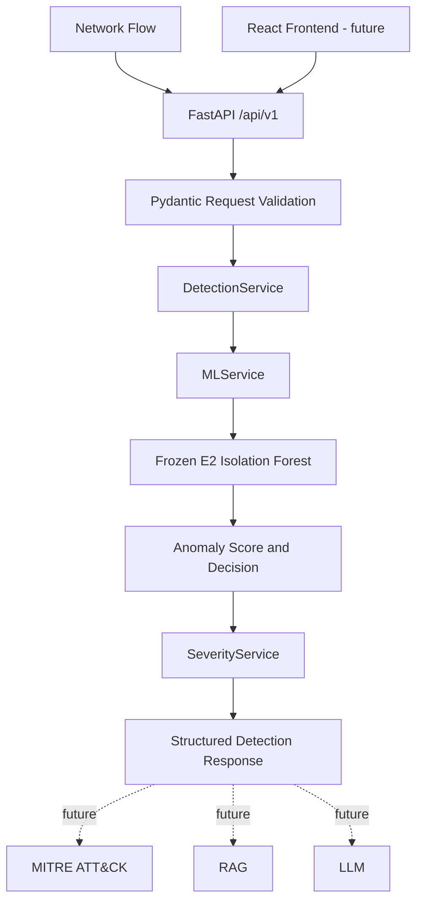

# Backend API

The backend serves the frozen E2 (`with_port`) CICIDS2017 Isolation Forest model through FastAPI. It accepts one network flow or a batch of flows, validates the request, reproduces the validated per-flow preprocessing, returns an anomaly score and decision, and adds the current placeholder severity classification.

```text
Network Flow
     |
     v
FastAPI
     |
Pydantic Validation
     |
Frozen E2 Isolation Forest
     |
Anomaly Score
     |
Severity
     |
Structured API Response
```

MITRE ATT&CK mapping, RAG retrieval, LLM explanations, React integration, and live traffic detection are extension points only. The current MITRE, RAG, and LLM services are no-op stubs and do not change the ML decision.

## Model Boundary

The primary detector is:

- Experiment: `with_port`
- Features: 60
- Model version: `isolation_forest_v1`
- Default operating point: `OP-A`
- OP-A threshold: `0.5219193851693676`
- OP-B threshold: `0.4878500998020172`
- Score semantics: higher `anomaly_score` means more anomalous

The inference decision is equivalent to:

```python
scores = -model.score_samples(X.values)
is_anomaly = scores >= threshold
```

The model and preprocessing artifacts are frozen. The API does not retrain, tune, mutate thresholds, or run dataset-level preprocessing.

## Setup

From the repository root:

```powershell
cd backend
python -m pip install -r requirements.txt
```

Copy `.env.example` to `.env` when local overrides are needed. Settings are loaded from environment variables and the optional `.env` file.

Supported settings include:

| Variable | Purpose | Default |
| --- | --- | --- |
| `APP_ENV` | Runtime environment label | `development` |
| `LOG_LEVEL` | Application log level | `INFO` |
| `API_VERSION` | API version label | `v1` |
| `MODEL_PATH` | Frozen model artifact path | `../data/processed/experiments/with_port/model.pkl` |
| `PREPROCESSING_CONFIG_PATH` | Frozen preprocessing config path | `../data/processed/experiments/with_port/preprocessing_config.json` |
| `ACTIVE_OPERATING_POINT` | Frozen threshold policy, `OP-A` or `OP-B` | `OP-A` |
| `ALLOWED_ORIGINS` | Comma-separated CORS origins | `http://localhost:3000,http://localhost:5173` |
| `MITRE_ENABLED` | Enable future MITRE stub | `false` |
| `RAG_ENABLED` | Enable future RAG stub | `false` |
| `LLM_ENABLED` | Enable future LLM stub | `false` |

## Run the Server

```powershell
cd backend
uvicorn app.main:app --reload
```

The default local URLs are:

- API base: <http://localhost:8000>
- Swagger UI: <http://localhost:8000/docs>
- OpenAPI document: <http://localhost:8000/openapi.json>

## Architecture



Responsibilities remain separate:

- ML: detection and anomaly scoring
- Severity: risk classification
- MITRE: future attack context
- RAG: future knowledge retrieval
- LLM: future explanation

The application loads `MLService` once during FastAPI lifespan startup. Health reports whether the model and preprocessing contract are ready.

## Preprocessing

API inference operates on one raw flow at a time and uses the authoritative E2 `preprocessing_config.json` plus model metadata:

```text
Raw feature values
        |
        v
Zero-duration handling
        |
        v
Configured log1p transformations
        |
        v
Configured signed-log transformations
        |
        v
Exact feature ordering
        |
        v
Isolation Forest
```

For a zero-duration flow, the backend adds `Is_Zero_Duration`, clips duration to `1` microsecond, and recomputes `Flow Packets/s` and `Flow Bytes/s` before applying transformations.

The feature names, order, and transformation lists are loaded from `preprocessing_config.json` and validated against the model metadata before the service becomes ready. The full dataset pipeline is not executed at request time: loading raw datasets, label repair, conflict removal, deduplication, source-day splitting, and training are outside the API.

## Operating Points

Both E2 operating points are frozen policy values:

| Operating point | Threshold |
| --- | ---: |
| `OP-A` | `0.5219193851693676` |
| `OP-B` | `0.4878500998020172` |

`ACTIVE_OPERATING_POINT=OP-A` is the default. Selecting `OP-B` is a configuration choice; the API has no threshold mutation or tuning endpoint.

## Severity

Severity is an **INITIAL PLACEHOLDER CALIBRATION**, not a validated security-risk model:

- `critical`: score `>= 0.80`
- `high`: score `>= 0.65`
- `medium`: score `>= threshold`
- `low`: score `>= threshold * 0.90`
- `info`: score below `threshold * 0.90`

This service can later be replaced with a calibrated risk model without changing the ML detection boundary.

## API Endpoints

### `GET /api/v1/health`

Reports application and model readiness. A ready response has this shape:

```json
{
  "status": "healthy",
  "model_status": "ready",
  "model_version": "isolation_forest_v1",
  "experiment_id": "with_port",
  "active_operating_point": "OP-A",
  "active_threshold": 0.521919,
  "timestamp": "2026-09-15T12:00:00+00:00"
}
```

When startup artifact loading fails, the application remains available for health reporting with `status: "degraded"` and `model_status: "not_loaded"`.

### `POST /api/v1/detect`

Scores one network flow. The JSON request uses the CICIDS-style feature aliases defined by the Pydantic schema, such as `Destination Port`, `Flow Duration`, `Flow Bytes/s`, and `Is_Zero_Duration`. The request must contain the 60-feature E2 contract except that `Is_Zero_Duration` is computed by the backend and may be omitted. Values must be finite numbers and unknown fields are rejected.

Processing is:

1. Validate the request schema.
2. Apply zero-duration handling and configured transformations.
3. Enforce the authoritative feature order.
4. Compute `-model.score_samples()`.
5. Compare the score with the active frozen threshold.
6. Classify placeholder severity.
7. Return detection, context, explanation, and metadata fields.

Representative response:

```json
{
  "request_id": "request-123",
  "detection": {
    "is_anomaly": true,
    "anomaly_score": 0.612345,
    "threshold": 0.521919,
    "experiment_id": "with_port",
    "operating_point": "OP-A"
  },
  "severity": {
    "level": "medium",
    "risk_score": 0.612345,
    "calibration_note": "INITIAL PLACEHOLDER CALIBRATION"
  },
  "attack_context": {
    "mitre_techniques": [],
    "retrieved_context": []
  },
  "explanation": {
    "summary": null,
    "reasoning": null,
    "recommendations": []
  },
  "metadata": {
    "model_version": "isolation_forest_v1",
    "source_dataset": "CICIDS2017",
    "timestamp": "2026-09-15T12:00:00+00:00"
  }
}
```

Per-feature attribution (`detected_features`) is not currently available and is not fabricated in this response schema.

### `POST /api/v1/detect/batch`

Accepts:

```json
{
  "flows": [
    { "Destination Port": 80, "Flow Duration": 10 }
  ]
}
```

The example is abbreviated; each flow must satisfy the complete request schema. Results preserve input order and are returned as:

```json
{
  "batch_id": "batch-123",
  "count": 1,
  "results": [
    { "request_id": "batch-123-0", "detection": {}, "severity": {}, "attack_context": {}, "explanation": {}, "metadata": {} }
  ],
  "timestamp": "2026-09-15T12:00:00+00:00"
}
```

An empty `flows` list returns `count: 0` and an empty `results` list. Any invalid flow causes request validation to fail rather than silently imputing values.

## Errors

API errors use the existing `ErrorResponse` schema:

```json
{
  "error_code": "INFERENCE_ERROR",
  "message": "An error occurred during anomaly inference",
  "details": {},
  "timestamp": "2026-09-15T12:00:00+00:00",
  "request_id": "request-123"
}
```

Supported application error codes are:

- `INVALID_INPUT`: request validation failed, including missing, non-numeric, NaN, Infinity, or extra fields.
- `FEATURE_MISMATCH`: feature contract or preprocessing configuration mismatch.
- `MODEL_NOT_READY`: model or preprocessing artifact is unavailable or invalid.
- `INFERENCE_ERROR`: model preprocessing or scoring failed.
- `INTERNAL_ERROR`: unexpected server failure.

Validation and feature errors use HTTP 422, model readiness errors use HTTP 503, and inference/internal errors use HTTP 500. Internal inference exception details are logged but are not exposed through the API.

## Current Backend Tree

```text
backend/
├── .env.example
├── requirements.txt
├── README.md
├── app/
│   ├── __init__.py
│   ├── main.py
│   ├── dependencies.py
│   ├── api/
│   │   ├── __init__.py
│   │   └── v1/
│   │       ├── __init__.py
│   │       ├── router.py
│   │       ├── health.py
│   │       └── detection.py
│   ├── core/
│   │   ├── __init__.py
│   │   ├── config.py
│   │   ├── exceptions.py
│   │   └── logging.py
│   ├── schemas/
│   │   ├── __init__.py
│   │   ├── common.py
│   │   ├── detection.py
│   │   └── health.py
│   └── services/
│       ├── __init__.py
│       ├── ml_service.py
│       ├── detection_service.py
│       ├── severity_service.py
│       ├── mitre_service.py
│       ├── rag_service.py
│       └── llm_service.py
└── tests/
    ├── __init__.py
    ├── conftest.py
    ├── fixtures/
    ├── unit/
    └── integration/
```

The listed MITRE, RAG, and LLM files are implemented extension stubs only. A React frontend and live detection source are future work.

## Verification

On 2026-09-15:

- Backend tests: 39 passed, 0 failed.
- Frozen consistency fixtures: maximum score difference `0.0`; threshold match `True`; prediction match `True`.
- `GET /api/v1/health`: PASS.
- `POST /api/v1/detect`: PASS.
- `POST /api/v1/detect/batch`: PASS.
- `/docs` and `/openapi.json`: PASS.
